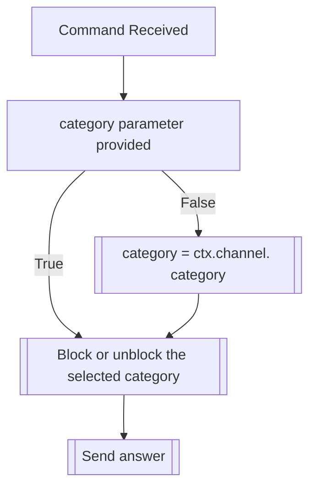

## Syntax
`/admin block_category <category>`

- `category`: A valid Discord Channel Category. If not provided, defaults to the current channel's category.

---

## Usage
This command is the same as [`/block category`](../block/category.md), but it applies to
the entire server, instead of a single user.

---

## Simplified internal logic
