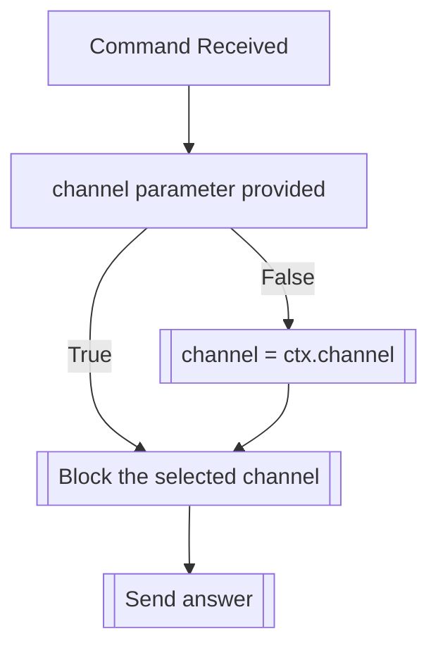

## Syntax
`/admin block_channel <channel>`

- `channel`: A valid Discord Channel. If not provided, defaults to the current channel.

---

## Usage
This command is the same as [`/block channel`](../block/channel.md), but it applies to
the entire server, instead of a single user.

---

## Simplified internal logic
