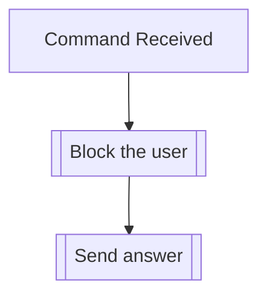

## Syntax
`/admin block_user [user]`

- `user`: A valid Discord User.

---

## Usage
This command is the same as [`/block user`](../block/user.md), but it applies a
server-wide ban, instead of only blocking them towards a single user.

---

## Simplified internal logic
