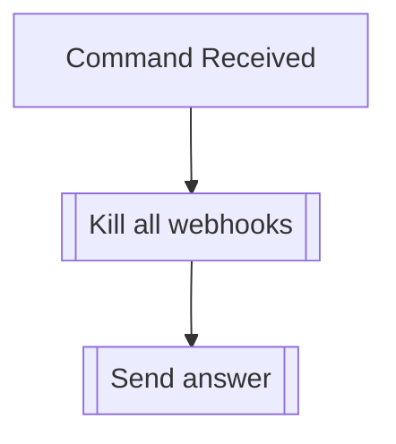

## Syntax
`/admin killhooks`

---

## Usage
This command will delete all the webhooks the bot has generated in a server. Its
intended use is to execute when the bot seems slower than usual, channels have been
modified, new channels have been blocked, or before kicking the bot. This command
doesn't tend to affect the performance of the bot.

---

## Simplified internal logic
