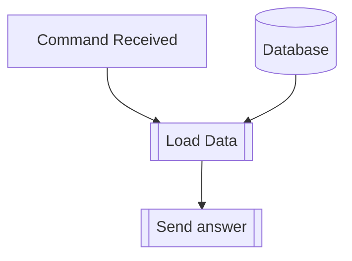

## Syntax
`/admin list_blocked_channels`

---

## Usage
This command will show you a list of the currently globally blocked channels for the
server.

---

## Simplified internal logic

```mermaid
flowchart TD
    CommandReceived[Command Received] --> LoadData[[Load Data]]
    Database[(Database)] --> LoadData
    LoadData --> SendAnswer[[Send answer]]
```