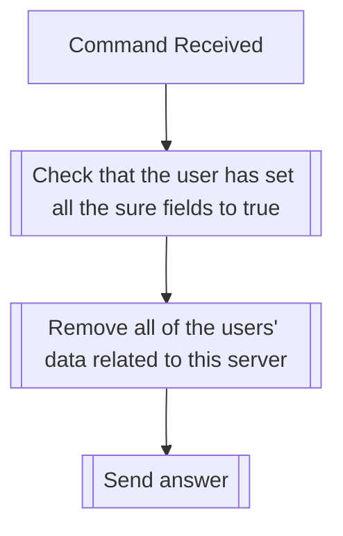

## Syntax
`/admin regen_server_tfs <sure> <really_sure> <really_really_sure> <fully_sure>`

- `sure`: A boolean, defaults false. Command won't execute unless true.

- `really_sure`: A boolean, defaults false. Command won't execute unless true.

- `really_really_sure`: A boolean, defaults false. Command won't execute unless true.

- `fully_sure`: A boolean, defaults false. Command won't execute unless true.

---

## Usage
This command acts as a server-wide panic button. It will delete all transformation data
related to the server, in an irrecoverable manner.

!!! danger
    Make sure you really want to execute this command. You will be removing all the
    data, of all your users, permanently. Make sure you have some kind of backup, if
    possible. The only two cases where you should execute this command are if the bot
    is not working properly and, after [contacting us](../../about.md#contact), we
    have told you this is the only solution, or if you update your server settings.

---

## Simplified internal logic
