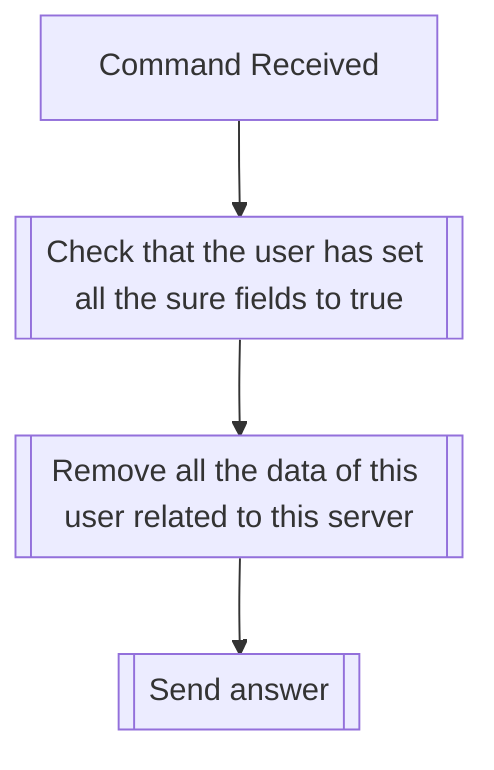

## Syntax
`/admin regen_user_tfs [user] <sure> <really_sure>`

- `user`: A valid Discord User, whose server data will be removed.

- `sure`: A boolean, defaults to false. Command won't execute unless true.

- `really_sure`: A boolean, defaults to false. Command won't execute unless true.

---

## Usage
If a user is corrupt, or you need to reset their data for any reason, this command
will do just that, akin to as if they had left the server and rejoined. Exercise
caution when using.

---

## Simplified internal logic
