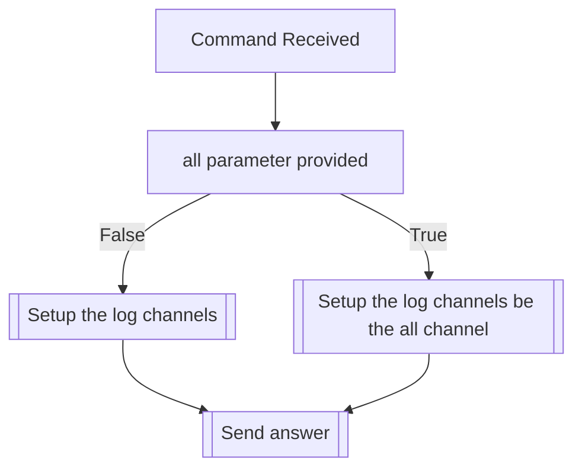

## Syntax
`/admin setup_logs <all> <edit> <delete> <transform> <claim>`

- `all`: A valid Discord Channel. If not provided, you must provide all other
         parameters. It will send all available log messages to this channel.
         If provided, will ignore all other provided values.

- `edit`: A valid Discord Channel. Edit message logs will be sent here.

- `delete`: A valid Discord Channel. Delete message logs will be sent here.

- `transform`: A valid Discord Channel. Transformation logs will be sent here.

- `claim`: A valid Discord Channel. Claim and safeword logs will be sent here.

---

## Usage
This command is used to set the logging functionalities of the bot, really useful for
server staff to keep track of what happens around without all the clout.

---

## Simplified internal logic
