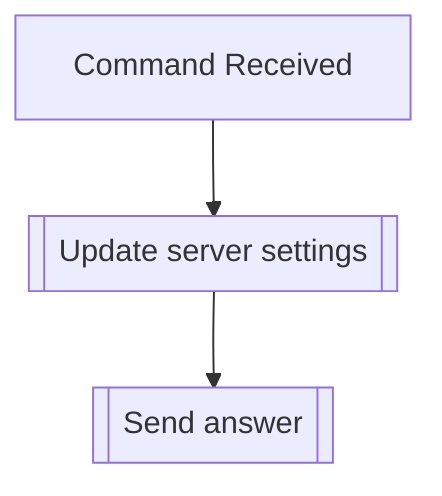

## Syntax
`/admin update_settings <clean_logs> <image_buffer>`

- `clean_logs`: A boolean, defaults false. If true, make the bot clean another bot's
                message deletion logs so the log channel doesn't clutter. (Only Dyno
                supported at the moment)

- `image_buffer': A Discord Channel. The channel where the bot will store temporary
                  images for transformations.

---

## Usage
This command is used to update the server-wide settings for the bot.

---

## Simplified internal logic
