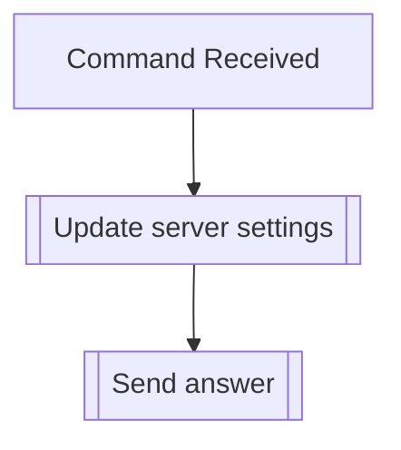

## Syntax
`/admin update_settings <clean_logs> <brackets>`

- `clean_logs`: A boolean, defaults false. If true, make the bot clean another bot's
                message deletion logs so the log channel doesn't clutter. (Only Dyno
                supported at the moment)

- `brackets`: A boolean, defaults false. If true, enables bracket mode on the server,
              that turns the bot into a TupperBox-like service. Regenerating server
              files is recommended after enabling this setting.

---

## Usage
This command is used to update the server-wide settings for the bot.

!!! warning
    It is recommended you check this command out when setting up your server, since
    water, when people have transformed each other, it can become quite a nuisance to
    regen the transformed data to make this work properly.

---

## Simplified internal logic
