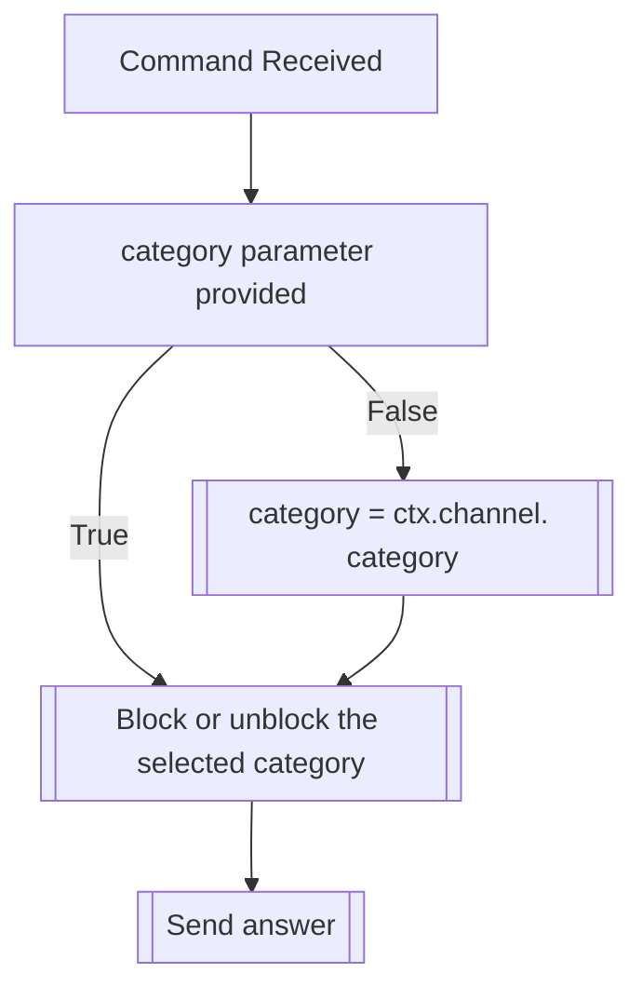

## Syntax
`/block channel <category>`

- `category`: A valid Discord Channel. If not provided, defaults to the current channel.

---

## Usage
This command is to be used when a user wants to block a channel category so that they,
and only they, won't interact with the bot in said channel category. This also means that,
even if you're transformed globally, your messages won't be altered on a blocked channel
category.

!!! note
    This command can also be used to unblock previously blocked channel categories, which will
    be automatically handled.

---

## Simplified internal logic
