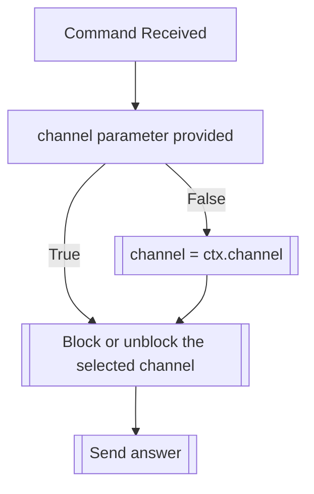

## Syntax
`/block channel <channel> <invert> <all_channels>`

- `channel`: A valid Discord Channel. If not provided, defaults to the current channel.

- `invert`: A boolean, defaults to false. If set to true, will invert the status of ALL
            channels, and ignores the `channel` parameter.

- `all_channels`: A boolean, defaults to false. If set to true, will ONLY BLOCK all the
                  channels on a server at once, ignoring the `channel` parameter.

---

## Usage
This command is to be used when a user wants to block a channel so that they, and only
they, won't interact with the bot in said channels. This also means that, even if
you're transformed globally, your messages won't be altered on a blocked channel.

!!! note
    This command can also be used to unblock previously blocked channels, which will
    be automatically handled.

---

## Simplified internal logic
