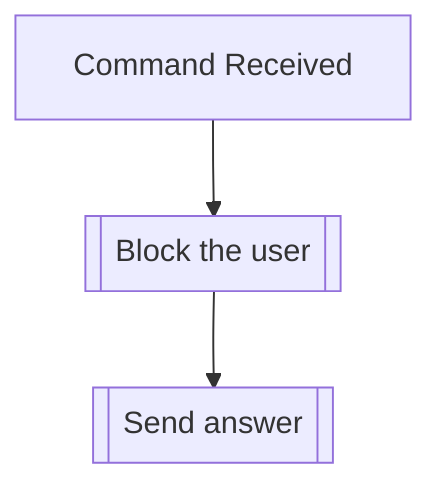

## Syntax
`/block user [user]`

- `user`: A valid Discord User.

---

## Usage
This command allows the user to block another user, which means they will be unable to
interact with you through the bot.

!!! note
    This block will only apply inside the server you're currently on.

!!! note
    This command can also be used to unblock previously blocked users, which will be
    automatically handled.

---

## Simplified internal logic
