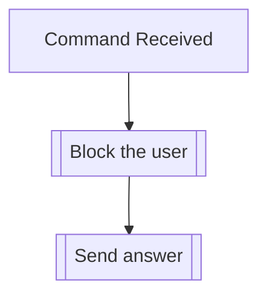

## Syntax
`/block user <user> <invert> <all_users>`

- `user`: A valid Discord User. If not provided, must provide either `invert` or `all_users`.

- `invert`: A boolean, defaults to false. If set to true, will invert the status of ALL
            users, and ignores the `user` parameter.

- `all_users`: A boolean, defaults to false. If set to true, will ONLY BLOCK all the
               users on a server at once, ignoring the `user` parameter.

---

## Usage
This command allows the user to block another user, which means they will be unable to
interact with you through the bot.

!!! note
    This block will only apply inside the server you're currently on.

!!! note
    This command can also be used to unblock previously blocked users, which will be
    automatically handled.

---

## Simplified internal logic
