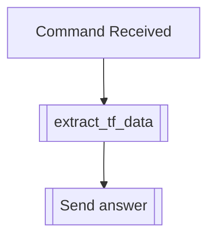

## Syntax
`/get bio <user>`

- `user`: A valid Discord User, defaults to the user executing the command. User to
          apply this modifier to.

---

## Usage
Lets you see the biography this user has set, if any.

---

## Simplified internal logic
