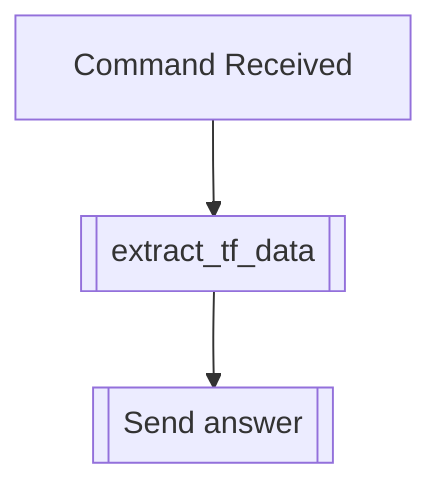

## Syntax
`/get censors <user>`

- `user`: A valid Discord User, defaults to the user executing the command. User to
          apply this modifier to.

---

## Usage
Lets you see the censors (and their respective replacements) this user has active, if
any.

---

## Simplified internal logic
