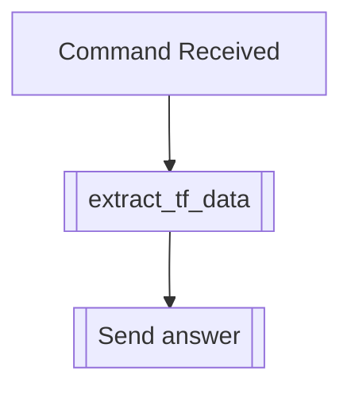

## Syntax
`/get image <user>`

- `user`: A valid Discord User, defaults to the user executing the command. User to
          apply this modifier to.

---

## Usage
Lets you see the avatar image this user has set, in full quality.

---

## Simplified internal logic
