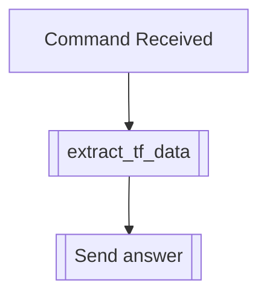

## Syntax
`/get muffle <user>`

- `user`: A valid Discord User, defaults to the user executing the command. User to
          apply this modifier to.

---

## Usage
Lets you see the muffles (and their respective chances) this user has active, if any.

!!! bug
    There's a [known issue](https://github.com/dorythecat/TransforMate/issues/50),
    due to which, the alternative muffle settings won't show up on this list.

---

## Simplified internal logic
