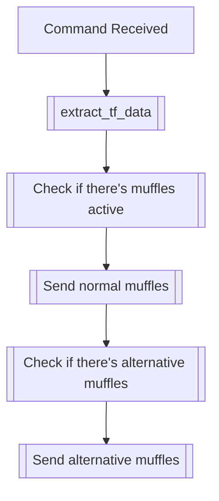

## Syntax
`/get muffle <user>`

- `user`: A valid Discord User, defaults to the user executing the command. User to
          apply this modifier to.

---

## Usage
Lets you see the muffles (and their respective chances) this user has active, if any.
Also, displays alternative muffles in a separate embed.

---

## Simplified internal logic
