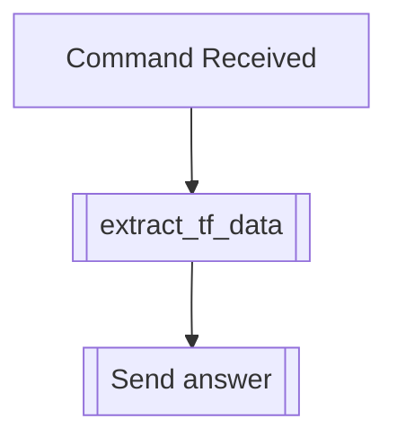

## Syntax
`/get settings <user>`

- `user`: A valid Discord User, defaults to the user executing the command. User to
          apply this modifier to.

---

## Usage
Lets you see what settings the user has on or off. Doesn't display claim status,
biography, or eternal status of a user.

---

## Simplified internal logic
