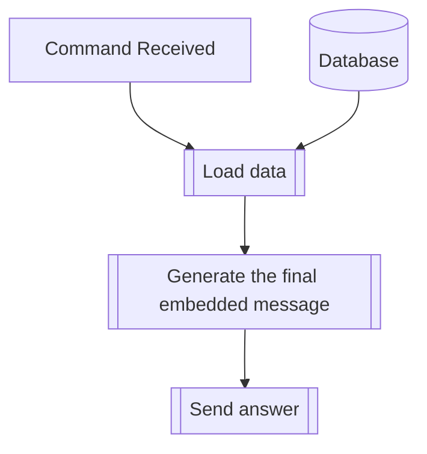

## Syntax
`/get transformed`

---

## Usage
Displays a list of all the transformed users in the current server, alongside the name
of their transformed form.

!!! bug
    Some of the mentions in the embedded message may display as <@number>.
    This is an error on the Discord client, and we can't do anything to fix
    it from our side, at least with how the command is currently set up.

    See [this](https://github.com/dorythecat/TransforMate/issues/51) feature
    request for a possible fix.

---

## Simplified internal logic
