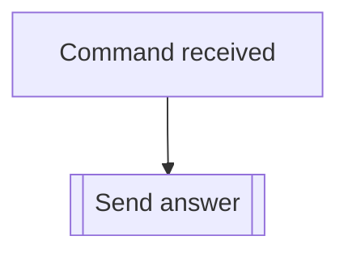

## Syntax
`/info`

---

## Usage
The `/info` command is meant to be used just to get a small embedded command that
allows you to see some info about the bot.

---

## Simplified internal logic

```mermaid
flowchart TD
    ReceiveCommand[Command received] --> SendAnswer[[Send answer]]
```