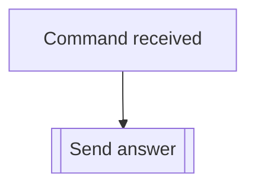

## Syntax
`/invite`

---

## Usage
The `/invite` command is meant to be used to get a link to invite the bot to your own
server(s).

---

## Simplified internal logic

```mermaid
flowchart TD
    ReceiveCommand[Command received] --> SendAnswer[[Send answer]]
```