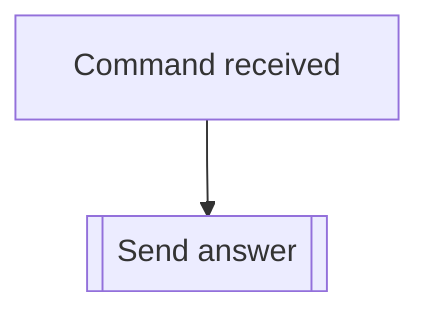

## Syntax
`/legal`

---

## Usage
The `/legal` command is meant to be used just to get a link to the
[Terms of Service](../../legal/tos.md) and
[Privacy Policy](../../legal/privacy_policy.md), as presented on this documentation.

---

## Simplified internal logic
