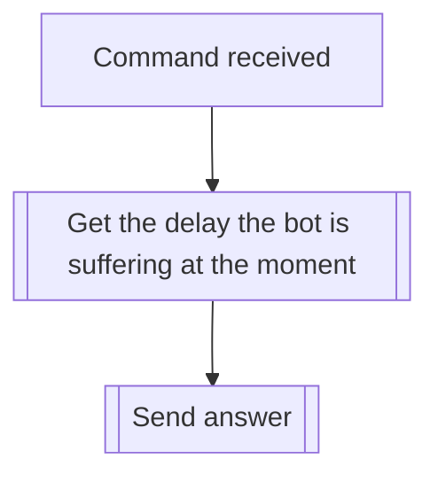

## Syntax
`/ping`

---

## Usage
The `/ping` command is meant to be used to get the delay the bot is suffering at the
moment, and is the recommended command to test whether the bot is connected or not.

---

## Simplified internal logic
