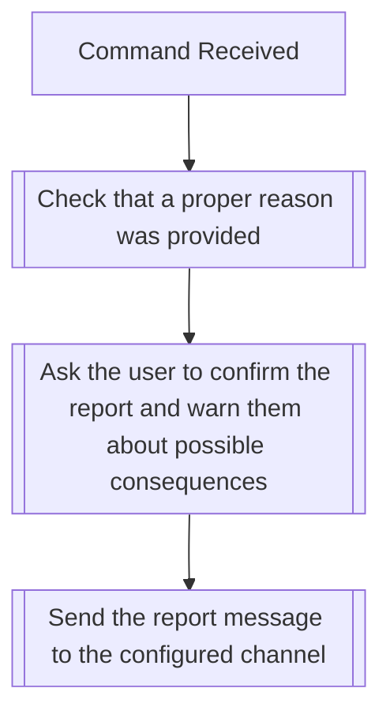

## Syntax
`/report [user] [reason]`

- `user`: A valid Discord User.

- `reason`: A string defining what the reason is for the report, preferably clearly
            described in a concise manner.

---

## Usage
The use of this command is reserved specifically to report wrongdoers that are in
direct vioation of the bot's [Terms of Service](../../legal/tos.md) or its
[Privacy Policy](../../legal/privacy_policy.md). It can also be used to report a
misuse of the bot in any other manner that hasn't been appropriately handled by the
server's own moderation team.

The bot will send this report to a private channel that only the bot owner can access,
including on the message: user that was reported, user that sent the report, reason for
the report, server name, and server owner.

!!! danger
    Do not use this command lightly. If you're found to be misusing this command, you
    might be permanently banned from using the bot again.

---

## Simplified internal logic
