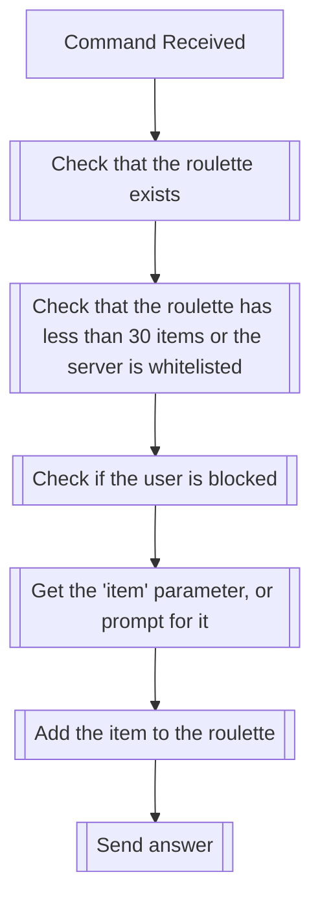

## Syntax
`/roulette add_item <item> <name>`

- `item`: A TSF string representing the item to be added to the roulette. If not
          provided, the bot will prompt for a string or file to fulfill the
          parameter.

- `name`: A string representing the name of the roulette to be created. This field
          defaults to "Default" if not provided.

---

## Usages
The command is used to add an item to an existing roulette in the server it is
executed in. The command will fail if no roulette with the given name exists, or
if the roulette already has 30 items in it and the server is not a part of the
PATREON_SERVERS environment variable.

---

## Simplified internal logic
