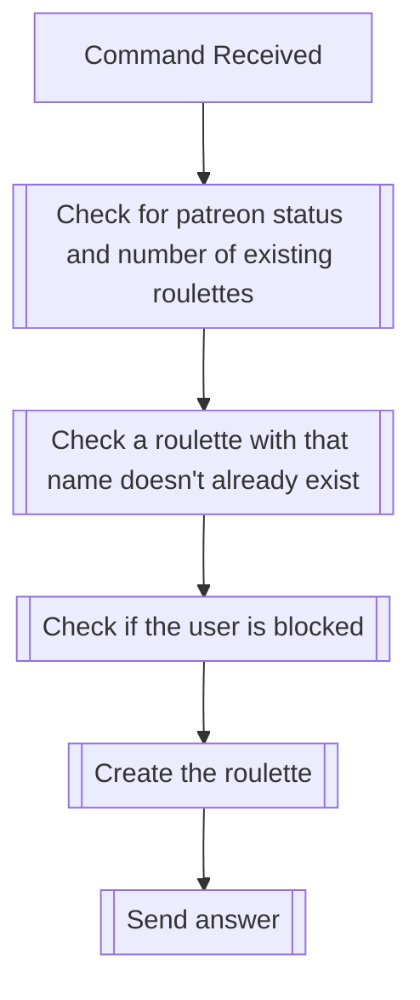

## Syntax
`/roulette create <name>`

- `name`: A string representing the name of the roulette to be created. No two
          roulettes in the same server can have the same name. This field defaults
          to "Default" if not provided.

---

## Usages
The command is used to create a new roulette in the server it is executed in.
The command will fail if a roulette already exists and the server isn't registered
in the PATREON_SERVERS environment variable.

---

## Simplified internal logic
