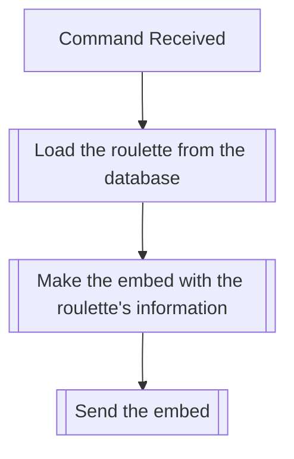

## Syntax
`/roulette info <name>`

- `name`: A string representing the name of the roulette to be rolled. This field
          defaults to "Default" if not provided.

---

## Usages
The command is used to get information about an existing roulette in the server
it is executed in. The command will fail if no roulette with the given name exists
in the server.

When the command is executed, it will return information about the roulette,
this being its name, its pulling method (unimplemented as of now), and the items
it contains as of that moment.

---

## Simplified internal logic
