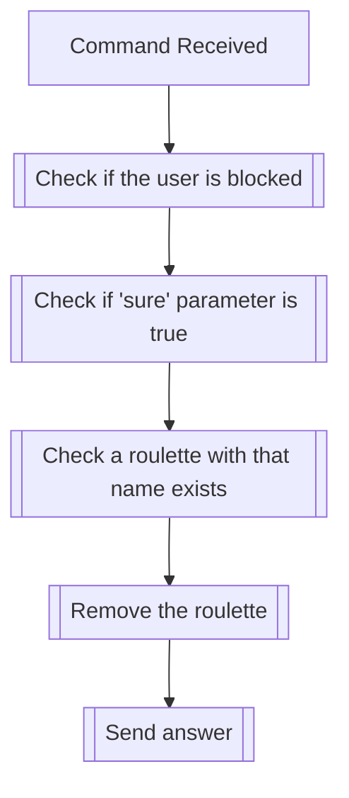

## Syntax
`/roulette create <sure> <name>`

- `sure`: A boolean that must be set to true to confirm the deletion of the
          roulette. This is to prevent accidental deletions.

- `name`: A string representing the name of the roulette to be created. This field
          defaults to "Default" if not provided.

---

## Usages
The command is used to remove an existing roulette in the server it is executed
in. The command will fail if no roulette with the given name exists.

---

## Simplified internal logic
