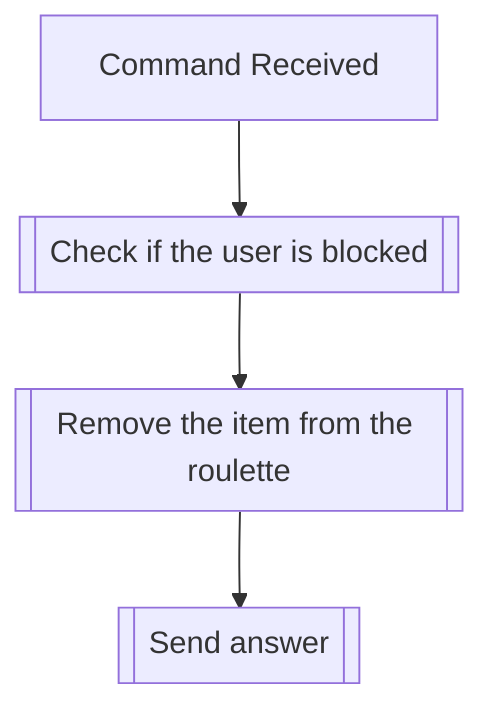

## Syntax
`/roulette remove_item <item> <name>`

- `item`: The name of the item to be removed from the roulette. This must
          exactly match the name of an existing item in the roulette.

- `name`: A string representing the name of the roulette to be created. This field
          defaults to "Default" if not provided.

---

## Usages
The command is used to remove an existing roulette in the server it is executed
in. The command will fail if no roulette with the given name exists.

---

## Simplified internal logic
