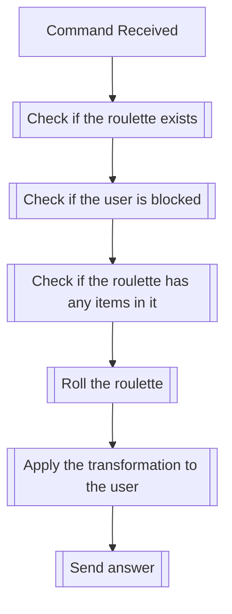

## Syntax
`/roulette roll <name>`

- `name`: A string representing the name of the roulette to be rolled. This field
          defaults to "Default" if not provided.

---

## Usages
The command is used to roll an existing roulette in the server it is executed
in. The command will fail if no roulette with the given name exists, or if the
roulette is empty.

When the command is executed, one of the items in the roulette is randomly
selected, with each item having an equal chance of being chosen. The selected
item is then applied as a transformation to the user who executed the command,
and the item is removed from the roulette.

---

## Simplified internal logic
