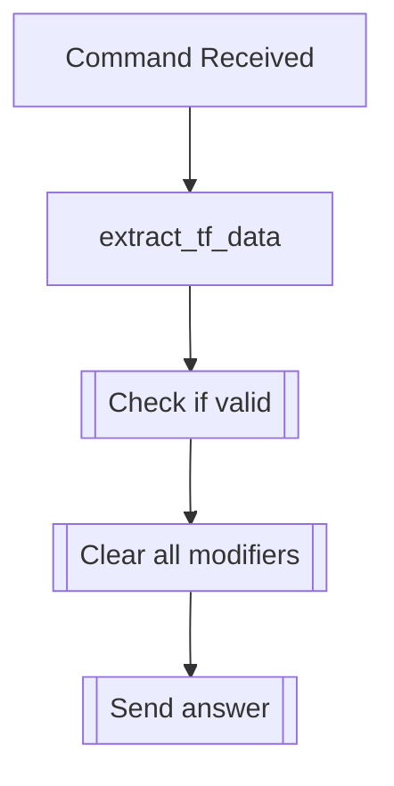

## Syntax
`/clear all_fiels <user>`

- `user`: A valid Discord User, defaults to the user executing the command.

---

## Usage
Clears all settings from a transformed user.

---

## Simplified internal logic
