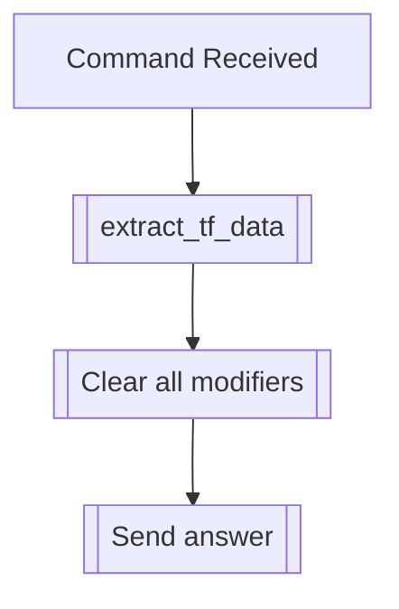

## Syntax
`/clear all_fiels <user>`

- `user`: A valid Discord User, defaults to the user executing the command. User to
          clear modifiers from.

---

## Usage
Clears all modifiers from a transformed user.

---

## Simplified internal logic
