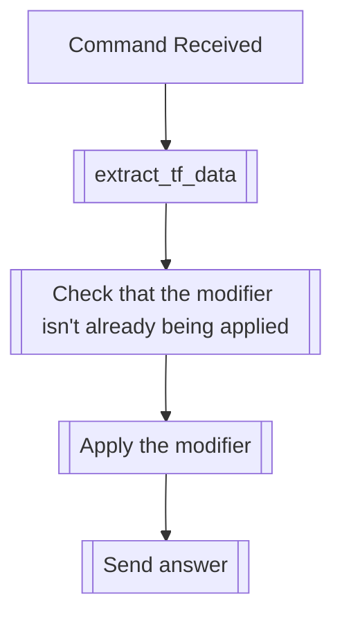

## Syntax
`/set backwards <user>`

- `user`: A valid Discord User, defaults to the user executing the command. User to
          apply this modifier to.

---

## Usage
This command will apply the backwards text modifier, which inverts the order of the
letters on the message.

---

## Simplified internal logic
