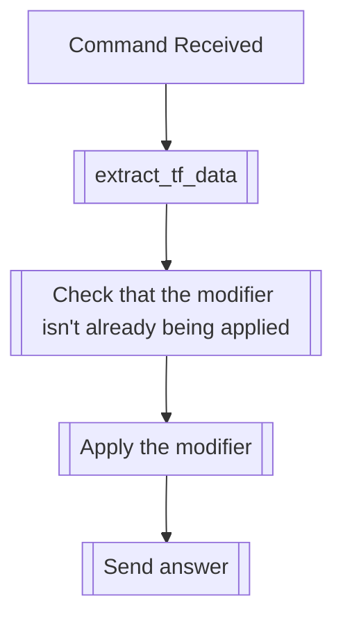

## Syntax
`/set big <user>`

- `user`: A valid Discord User, defaults to the user executing the command. User to
          apply this modifier to.

---

## Usage
This command will apply the big text modifier to the specified user. This modifier
will make it so that every message the user speaks will be displayed as big text, by
using Discord's Markdown `#` modifier in front of the message.

---

## Simplified internal logic
