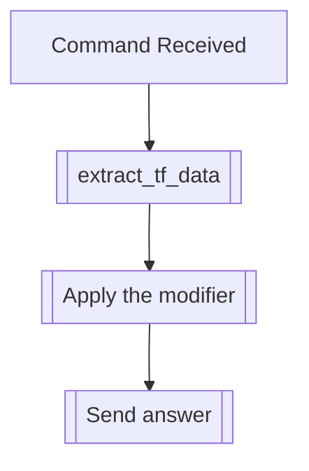

## Syntax
`/set bio [biography] <user>`

- `biography`: A valid string, that will be set as the biography of the user.

- `user`: A valid Discord User, defaults to the user executing the command. User to
          apply this modifier to.

---

## Usage
This command will set a biography for the selected user. This doesn't have any defined
practical usage, and can be used for anything that requires storing a string, from
indicating the author of a transformation, the expected usage, or a backstory.

---

## Simplified internal logic
