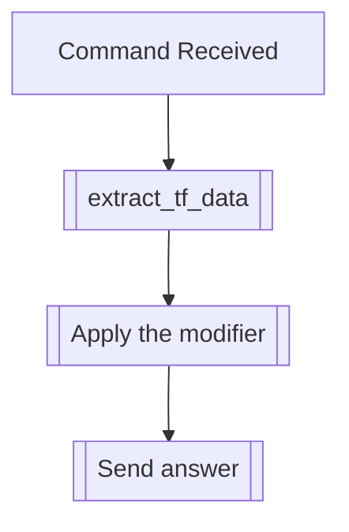

## Syntax
`/set censor [censor_word] [replacement] <user>`

- `censor_word`: A string, that will be censored and replaced.

- `replacement`: A string, that will replace the censored word.

- `user`: A valid Discord User, defaults to the user executing the command. User to
          apply this modifier to.

---

## Usage
This command will apply the censor text modifier, which will replace every instance
(case-insensitive) of the `censor_word` parameter with the `replacement` parameter,
effectively censoring said word. Multiple censored pairs can be set.

---

## Simplified internal logic
