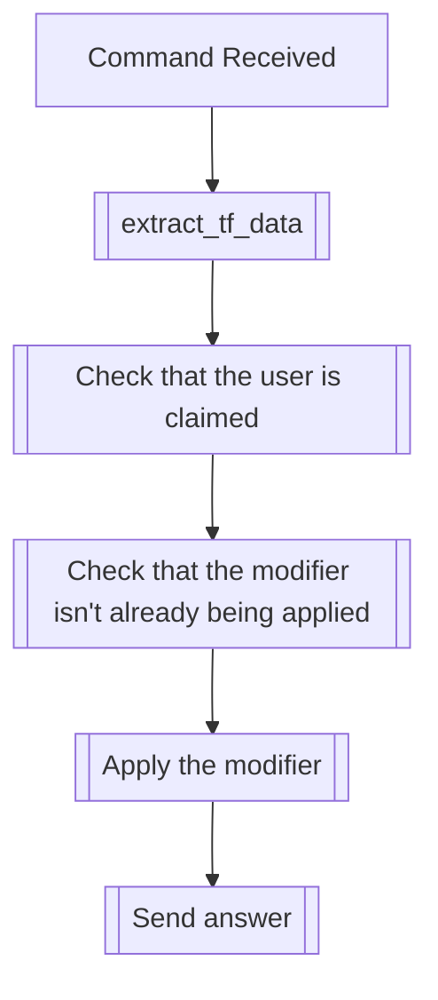

## Syntax
`/set eternal <user>`

- `user`: A valid Discord User, defaults to the user executing the command. User to
          apply this modifier to.

---

## Usage
This command will apply the eternal modifier, which will make it so that the user is
unable to be transformed or modified by anyone but the user that has previously
claimed them.

!!! info
    The user should be claimed to be able to use this command. Not only that, but you
    must be the user that claimed them, or the command will fail.

---

## Simplified internal logic

!!! note
    The command doesn't check whether the owner of the claim is the user executing the
    command, since the [`extract_tf_data`](index.md#the-extract_tf_data-function)
    function already executes that check.