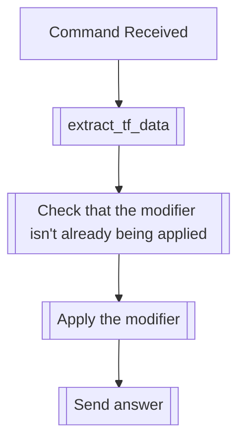

## Syntax
`/set hush <user>`

- `user`: A valid Discord User, defaults to the user executing the command.

---

## Usage
This command will apply the hush text modifier, which will "hush" the user, by
"censoring" all of their messages, using Discord's Markdown modifier, `||`, to achieve
this result.

---

## Simplified internal logic
