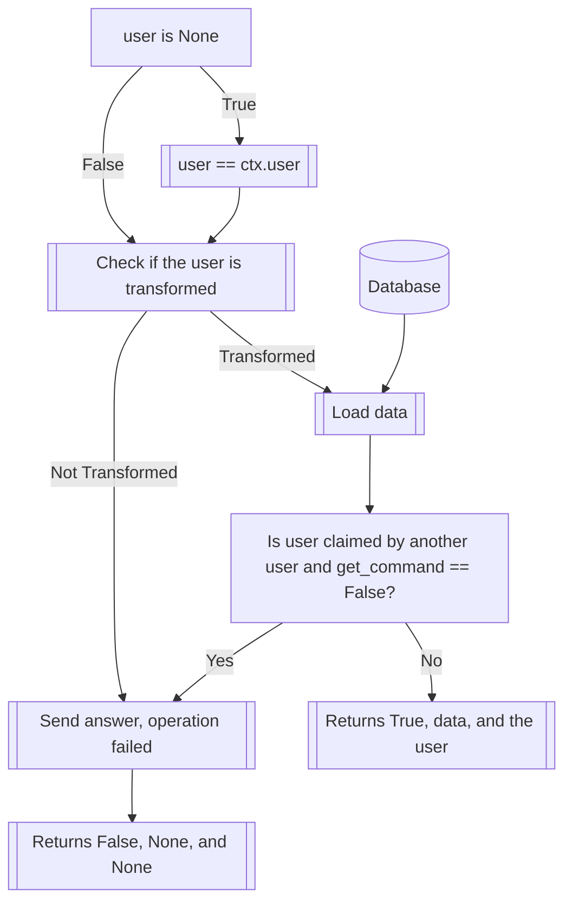

The "set" commands allow you to, as the name implies, set (and modify) almost every
setting a transformed user has. For now, most of these settings, excluding the
biography, are speech modifiers that alter their messages, in one way or another.

The "clear" commands, on the other hand, allow you to clear the settings the user
has, individually or all at once.

!!! warning
    Remember that there's no undo button for these commands; clearing a setting
    will mean that you'll have to set it up again if you decide it was something
    you wanted.

??? info
    All clear commands follow the same structure:
    `/clear [modifier] <user> <word>` where the modifier is the same keyword used
    by the respective set command. User can always be specified, but the word
    field can only be specified when the modifier takes a word as an input,
    i.e., prefix, suffix, muffle, sprinkle, censor...
    !!! warning
        Not providing a word value when executing a clear command that accepts it
        will result in the removal of ALL modifiers of that class, i.e., if a user
        has seven sprinkles set, and you use `/clear sprinkle <user>`, without the
        word parameter, all seven will be removed from the user. Exercise caution.

For consistency, all chance values default to 30% if unspecified, for every set
command listed here.

- [`/clear all_fields <user>`](all_fields.md)
??? info
    Clears the entirety of a user's configuration (except claims), effectively
    undoing any previous set commands.
    !!! warning
        We recommend you save a transformation before clearing all the settings of a
        user. That will reduce the chance of you regretting it later.

- [`/set prefix [prefix_word] <prefix_chance> <user> <whitespace>`](prefix.md)
??? info
    Sets a prefix string[^1] that will go before the message the user has sent,
    with a certain random chance of this happening.

- [`/set suffix [suffix_word] <suffix_chance> <user> <whitespace>`](suffix.md)
??? info
    Sets a suffix string[^1] that will go after the message the user has sent,
    with a certain random chance of this happening.

- [`/set big <user>`](big.md)
??? info
    Makes all the text the user writes big.

- [`/set small <user>`](small.md)
??? info
    Makes all the text the user writes small.

- [`/set hush <user>`](hush.md)
??? info
    "Hushes" the user, that is to say, makes it into a spoiler, effectively 
    emulating the user being unable to speak, but maintaining a certain level of
    mutual understanding through the underlying text.

- [`/set backwards <user>`](backwards.md)
??? info
    Makes the user's text be inverted completely.

- [`/set eternal <user>`](eternal.md)
??? info
    !!! note
        Requires the user to have been claimed by another user.
    "Eternally" transforms a user, that is to say, makes the user unable to
    modify themselves or be modified by anyone that isn't the user that claimed
    them.

- [`/set censor [censor_word] [replacement] <user>`](censor.md)
??? info
    "Censors" a word, by replacing it with whatever replacement you choose every
    time the user tries to say it.

- [`/set sprinkle [sprinkle_word] <sprinkle_chance> <user>`](sprinkle.md)
??? info
    Randomly sprinkles a word in between whatever the user says, without replacing
    any other words.

- [`/set muffle [muffle_word] <chance> <alt> <user>`](muffle.md)
??? info
    "Muffles" a message, effectively replacing random words with whatever you
    choose, or, if the alternative mode is on, it will substitute entire
    messages.

- [`/set stutter <chance> <user>`](stutter.md)
??? info
    Makes the user stutter. T-this makes t-them talk in a s-similar manner to
    t-this.

- [`/set bio`](bio.md)
??? info
    Sets the user's biography, which, at the moment, is mainly used to describe
    saved characters to others in an easy manner, though it can be used to list
    any kind of information, like limits, kinks, information, etc.

[^1]: Even if the variables are named "prefix_word" and "suffix_word", every set
command field that asks for a string supports longer and multi-word strings.
See [Issue #49](https://github.com/dorythecat/TransforMate/issues/49).
This should be fixed in a following update. When it is fixed, this page will be
updated to reflect said change.

---

## The `extract_tf_data` function
This function is used in all `/set` and `/clear` commands, so it is only fair to
explain it here. If you don't want the technical ramble and logic explanation, you
may skip this section with no problems.

This function is located inside the `utils.py` file, and serves as a utility for
all of these functions, because they all need to do the same checks and require
variations of the same data.

The function signature contains four variables, `ctx`, representing the Discord
environment provided by the API and PyCord, `user`, representing the Discord User
whose data we want to extract, `get_command`, which is a boolean stating whether
the origin of the request is a `/get` command, and `channel`, which refers to a
Discord Channel to extract the data at (currently unused, in practice).

The function returns a boolean, indicating whether a user is a valid target or not,
the data of said user, and, finally, the user. The simplified logic diagram is
shown here.

Any time the function is used, the pertinent command checks if the user is valid or
not (so, whether the first return argument is True), and this step will be omitted in
future logic trees, to avoid unnecessary clutter.

---

## Simplified internal logic of `/clear` commands
All the `/clear` commands (except `/clear all_fields`, which has its own article),
follow more-or-less the same logic as their `/set` counterparts, but instead of
adding the modifier, they clear it (and they don't apply any extra string
modifications, ike the affixes adding whitespace). Due to this, simplified logic
sections and diagrams won't be specifically added (at this point, at least) for
these commands.