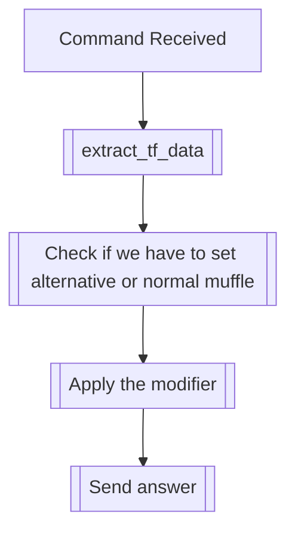

## Syntax
`/set muffle [muffle_word] <chance> <alt> <user>`

- `muffle_word`: A string, to muffle words throughout the messages sent by the user.

- `chance`: An integer from 0 to 100, defaults 30. The chance, in percentage, of the
            muffle being used for a given word in a message.

- `alt`: A boolean, defaults false. If true, enables the alternative muffle for the
         input word, with the specified chance.

- `user`: A valid Discord User, defaults to the user executing the command. User to
          apply this modifier to.

---

## Usage
This command will apply the muffle ext modifier, which will replace random words from
the user's messages with the strings you set. If `alt` is set to be true, the
alternative muffle mode will be used, which will replace entire messages with the
strings you set. You can even combine the alternative and normal muffle in the same
user with no problems!

---

## Simplified internal logic
