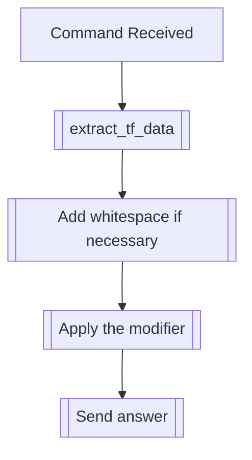

## Syntax
`/set prefix [prefix] <chance> <user> <whitespace>`

- `prefix`: A string, to add to the prefix list.

- `chance`: An integer from 0 to 100, defaults 30. The chance, in percentage, of the
            prefix being used for a given message.

- `user`: A valid Discord User, defaults to the user executing the command. User to
          apply this modifier to.

- `whitespace`: A boolean, defaults true. Whether to include whitespace after the
                prefix, so it doesn't join the message after it.

---

## Usage
This command is used to add a prefix modifier, that is to say, a word or string that
will appear before certain messages, with a specific chance of it occurring.

---

## Simplified internal logic
