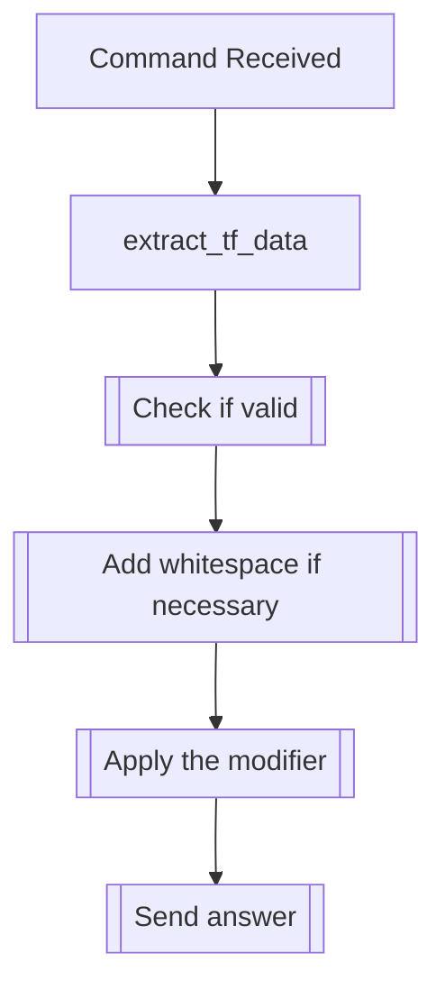

## Syntax
`/set prefix [prefix_word] <prefix_chance> <user> <whitespace>`

- `prefix_word`: A string. Word to add to the prefix list.

- `prefix_chance`: An integer from 0 to 100, defaults 30. The chance, in percentage,
                   of the prefix being used for a message.

- `user`: A valid Discord User, defaults to the command sender. User to apply the
          modifier to.

- `whitespace`: A boolean, defaults true. Whether to include whitespace after the
                prefix, so it doesn't join the message ahead.

---

## Usage
This command is used to add a prefix modifier, that is to say, a word or string that
will appear before certain messages, with a specific chance of it ocurring.

---

## Simplified internal logic
