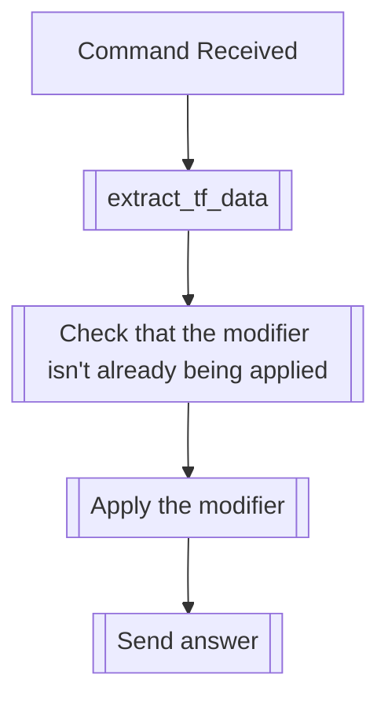

## Syntax
`/set small <user>`

- `user`: A valid Discord User, defaults to the user executing the command.

---

## Usage
This command will apply the small text modifier to the specified user. This modifier
will make it so that every message the user speaks will be displayed as small text,
by using a combination of Discord's Markdown `-#` modifier, and an alphabet
substitution for a set of small Unicode characters. When using this modifier, some
letters might be replaced by other similar symbols, due to limitations.

---

## Simplified internal logic
