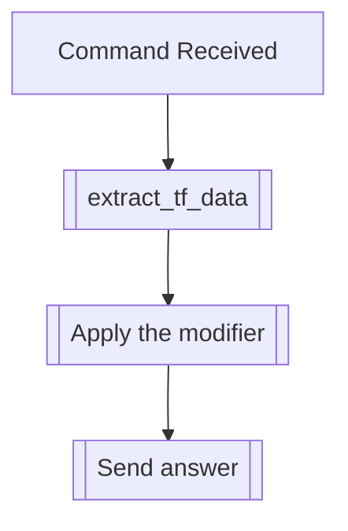

## Syntax
`/set sprinkle [sprinkle_word] <sprinkle_chance> <user>`

- `sprinkle_word`: A string, to be sprinkled throughout the messages sent by the user.

- `sprinkle_chance`: An integer from 0 to 100, defaults 30. The chance, in percentage,
                     of the sprinkle being used for a given word in a message.

- `user`: A valid Discord User, defaults to the user executing the command. User to
          apply this modifier to.

---

## Usage
This command will apply the sprinkle text modifier, which will sprinkle the word you
have set in between the words of the messages the user sends, with a certain random
chance. Multiple sprinkles can be set, with individual chances.

---

## Simplified internal logic
