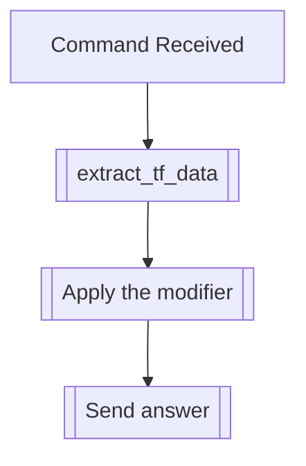

## Syntax
`/set stutter <chance> <user>`

- `chance`: An integer from 0 to 100, defaults 30. The chance, in percentage, of the
            user stuttering.

- `user`: A valid Discord User, defaults to the user executing the command. User to
          apply this modifier to.

---

## Usage
This command will apply the stutter text modifier, which will make the user stutter
with a certain chance. If the chance is high, hey might even have multi-letter
stuttering.

---

## Simplified internal logic
