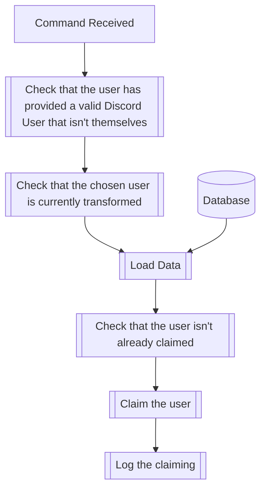
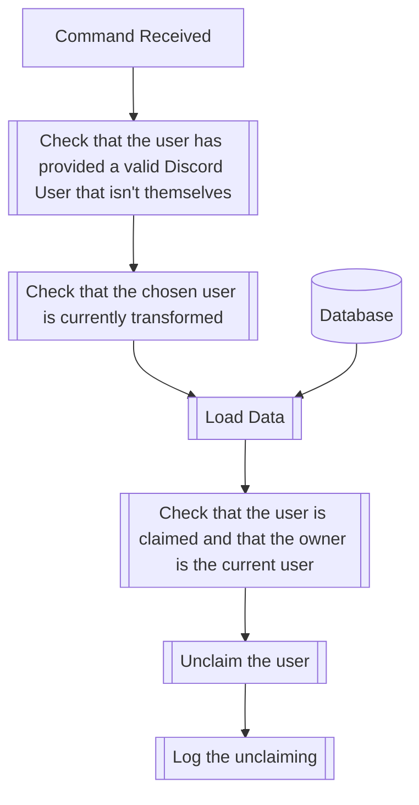

## Syntax
`/(un)claim [user]`

- `user`: A valid Discord User to (un)claim.

---

## Usage
The `/claim` and `/unclaim` commands are used to claim and unclaim users, respectively.
A claimed user will only be able to be altered by the user that claimed them until
they're unclaimed or use the [`/safeword`](safeword.md) command.

---

## Simplified internal logic for `/claim`

---

## Simplified logic for `/unclaim`
