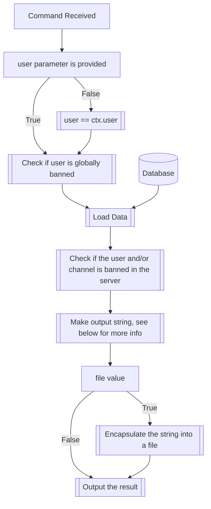

## Syntax
`/export_tf <user> <file>`

- `user`: A valid Discord User to export their transformation data. If not provided,
          the user executing the command will be used.

- `file`: A boolean, defaults true. If set to false, will return the plain string,
          otherwise returns a .tf file containing the string.

---

## Usage
The `/export_tf` command is used in coordination with the [`/import_tf`](import_tf.md)
to save and load transformation data to and from flies and/or strings.

---

## Simplified internal logic

---

## Transformation String Format
The Transformation String Format (TSF) is a standard manner of encoding
transformation data, in an uncompressed, human-readable, and easy o edit manner. It
possesses various revisions, reflecting their equivalent version of the internal
TransforMate User Data (TMUD). The numbering starts as 0, where TSFv0 is compatible
with TMUDv14 (Both deprecated since v1.5.0).

!!! note
    The TMUD standard isn't documented as-is and only exists inside the
    [`utils.py`](https://github.com/dorythecat/TransforMate/blob/main/src/utils.py)
    file of TransforMate, where the changelog is located too.

    If you would like for a TMUD documentation to be published, please
    [contact us](../../about.md#contact)

!!! note
    The TSF and TMUD format are both open and licencsed under the same
    [license](https://github.com/dorythecat/TransforMate/blob/main/LICENSE) as the bot,
    so you can use them freely for your projects, modify, and propose changes to them.

!!! warning
    TSF is backwards compatible with all previous versions (except v0, deprecated
    since v2.0.0), but TMUD is NOT.

The current specification, here described, is TSFv1.0, used since v1.5.0. The
documentation for v0 will not be released, but every version since v1 will be kept
as an archive for future reference, with the expected behavior when importing said
versions of TSF data.

### v1.0 specification
This version counts with 22 parameters separated using the `;` character.
The parameters are displayed here, with an explanation where necessary, and divided
into categories for easier understanding. For more information on the modifiers, see
their respective [modifier page](../set_and_clear/index.md).

#### Note: Data representation
The TSF standard uses three types of data: Booleans, Integers, and Strings. Any object
can represent booleans. They will be considered to be false when they're equal to `0`.
Any other value will be interpreted as true, but using `1` for these cases is the
recommended use. Integers are represented by numbers from 0 to 100. Any value outside
of these bounds should be clamped when going back and forth between TSF and TMUD, to
comply with the standard. Finally, strings are UTF-8 strings of arbitrary length.

#### Basic data
This data is vital for the TSF data to be valid. Its the information that would
normally be given through the [`/transform`](transform.md) command, except for the
`brackets` parameter.

- `version`: This parameter encodes the TMUD version this TSF file was written as.
             Should always be 15 for TSFv1.0.

- `into`: Name of the transformed avatar.

- `image_url`: URL pointing to a valid image that serves as the transformed avatar's
               profile picture.

#### Boolean modifiers
These modifiers are always populated, as they represent the four boolean modifiers the
bot has available.

- `big`: Big text.

- `small`: Small text.

- `hush`: Hush messages (Discord spoiler).

- `backwards`: Invert text.

#### Basic modifiers
<<<<<<< HEAD
These modifiers aren't separated within themselves, since they are simple strings or
=======
These modifiers aren't separated within themselves since they are simple strings or
integers.

- `stutter`: Stutter modifier. Integer from 0 to 100.

- `proxy_prefix`: The prefix required to use the transformation in Tupper-like servers.

- `proxy_suffix`: The suffix required to use the transformation in Tupper-like servers.

- `bio`: A string with any length, containing a biography or any kind of user-defined
         information about the transformation.

#### Complex modifiers
These modifiers require a bit more of processing. All of them follow the same
pattern though; they are a dictionary, with elements separated with the `,`
character, and pairs denoted with the `|` character. For all except the `censor`
parameter, these are string-integer pairs, with the integer being a number from 0
to 100. In the case of the `censor` parameter, it's all string-string pairs.

There will always be a boolean value preceding each of these modifiers, indicating
if they are active or not.

!!! note
    This preceding boolean should be removed in a future revision of the standard.

Each of these parameters is preceded by another parameter, valued either one or zero,
indicating the "active" status of these modifiers. If the value is 0, the modifier
will be ignored.

- `prefix`: Strings that go before the text the user has sent, with a certain chance.

- `suffix`: Strings that go after the text the user has sent, with a certain chance.

- `sprinkle`: Strings that are randomly sprinkled between words that the user has sent.

- `muffle`: Strings that randomly replace words that the user has sent.

- `alt_muffle`: Strings that fully replace what the user has sent.

- `censor`: Replaces the first string of the pair for the second one. Case-insensitive.

### A note on TSF files
The Transformation String Format was originally designed to encode transformation
data in an efficient, easy to edit, and more or less human-readable manner. It was
originally designed as a translation layer between the JSON of the TMUD format
and something that could be easily handled by humans interacting over Discord.

An alternative mode was born out of this, the TSF File Format. As of the latest
version of TSF, this file format simply consists of a TSF-compliant string,
packaged in any kind of readable UTF-8 encoded file, preferably terminated with the
`.tsf` denominator, for ease of identification.

It is a supported addition of the standard and can even be used to replace TMUD
files, in a more space-efficient manner.

!!! warning
    Unlike TMUD, TSF does not store the blocked status of users or channels, as of
    the latest revision. It also does not differentiate between channels and
    servers, so an actual full TMUD replacement using the current version of TSF
    would not be viable.