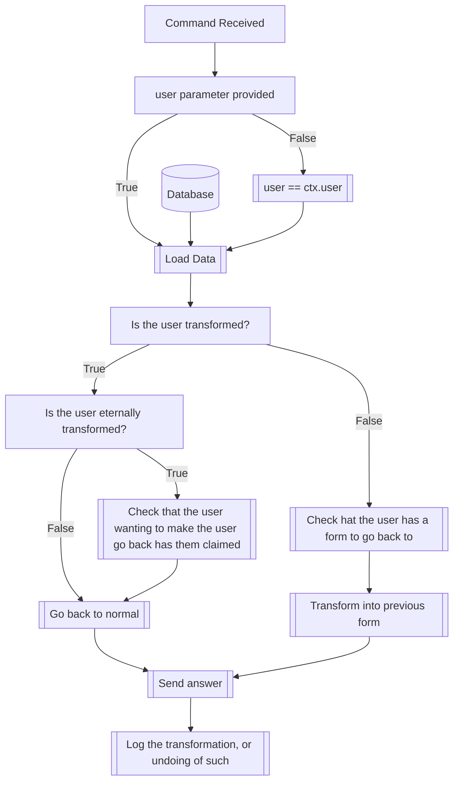

## Syntax
`/goback <user>`

- `user`: A valid Discord User. Defaults to the user executing the command.

---

## Usage
The `/goback` command can be used to return a user to their normal self, or, if
they have been transformed previously by another user or themselves, to turn them
back to their last form.

---

## Simplified internal logic
